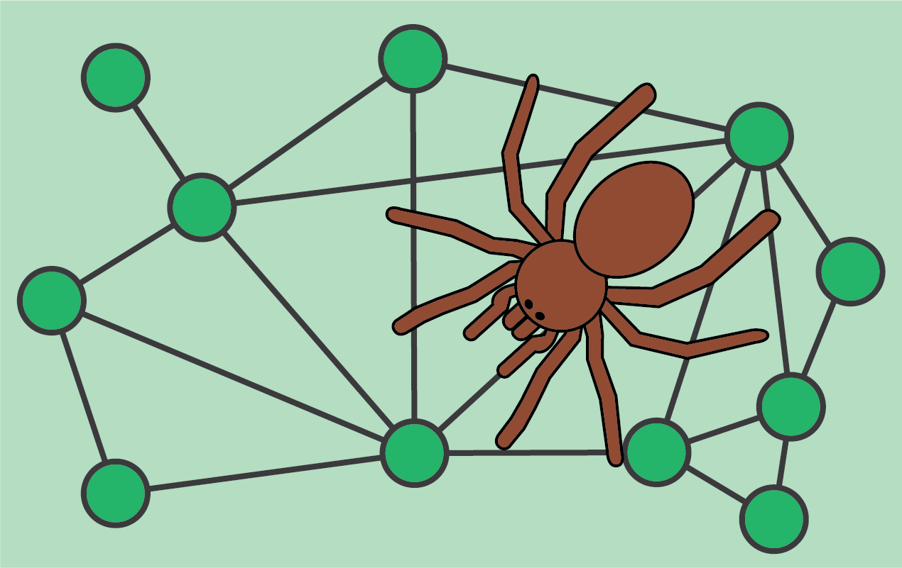

# MossSpider

MossSpider provides an implementation of the targeted maximum likelihood estimator for network-dependent data
(network-TMLE) in Python. Currently `mossspider` supports estimation of the conditional network mean for stochastic
policies.

## Installation

### Installing:

You can install via `python -m pip install mossspider`

### Dependencies:

The dependencies are: `numpy`, `scipy`, `statsmodels`, `networkx`, `matplotlib`. Notice that NetworkX must be at least
2.0.0 to work properly.

## Getting started

To demonstrate `mossspider`, below is a simple demonstration of calculating the mean for the following data.

```python
from mossspider import NetworkTMLE
from mossspider.dgm import uniform_network, generate_observed
```

First, we will use some built-in data generating functions
```python
graph = uniform_network(n=500, degree=[1, 4])
graph_observed = generate_observed(graph)
```

Now, we can use `NetworkTMLE` to estimate the causal conditional mean under a stochastic policy. Here, the stochastic
policy sets everyone's probability of action `A=1` to 0.65.

```python
ntmle = NetworkTMLE(network=H,     # NetworkX graph
                    exposure='A',  # Exposure in graph
                    outcome='Y',   # Outcome in graph
                    verbose=True)  # Print model summaries
ntmle.exposure_model(model="W + W_sum")
ntmle.exposure_map_model(model='A + W + W_sum',  # Parametric model
                         measure='sum',          # Summary measure for A^s
                         distribution='poisson') # Model distribution to use
ntmle.outcome_model(model='A + A_sum + W + W_sum')
ntmle.fit(p=0.65, samples=500)
ntmle.summary()
```

For full details on using `mossspider`, see the full documentation and worked examples available
at [MossSpider website](https://deli.readthedocs.io/en/latest/).
